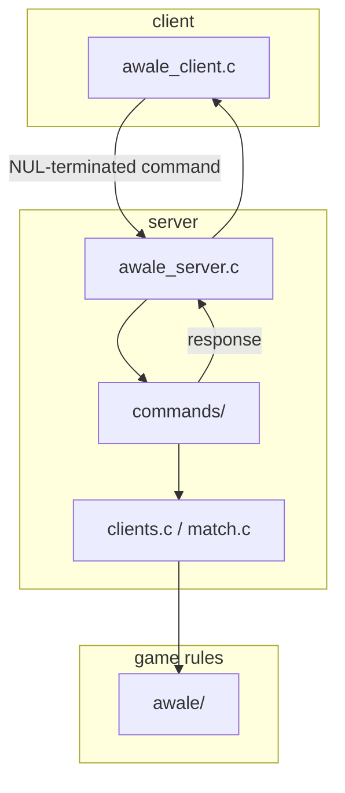

# Architecture

```mermaid
flowchart TD
  subgraph CLIENT["client"]
    CLI["awale_client.c"]
  end

  subgraph SERVER["server"]
    ACC["awale_server.c"]
    CMD["commands/"]
    DATA["clients.c / match.c"]
  end

  subgraph GAME["game rules"]
    AWALE["awale/"]
  end

  CLI -->|"NUL-terminated command"| ACC
  ACC --> CMD
  CMD --> DATA
  DATA --> AWALE
  CMD -->|"response"| ACC
  ACC --> CLI
```
