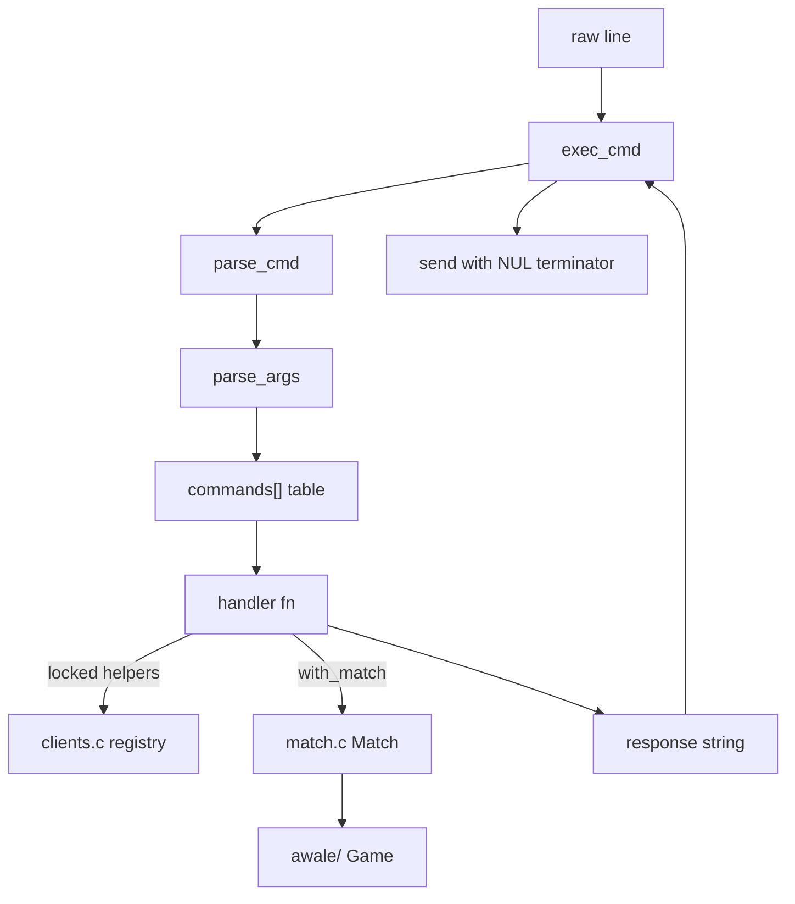

# Command layer

```mermaid
flowchart TD
  LINE["raw line"] --> EXEC["exec_cmd"]
  EXEC --> PC["parse_cmd"]
  PC --> PA["parse_args"]
  PA --> TABLE["commands[] table"]
  TABLE --> FN["handler fn"]
  FN -->|"locked helpers"| REG["clients.c registry"]
  FN -->|"with_match"| MATCH["match.c Match"]
  MATCH --> GAME["awale/ Game"]
  FN --> RESP["response string"]
  RESP --> EXEC
  EXEC --> SEND["send with NUL terminator"]
```
